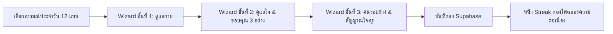

# 📖 HEARTFUL — School Diary App (Project Overview & AI Onboarding Guide)

เอกสารนี้สรุปภาพรวม สถาปัตยกรรม โครงสร้างโค้ด ฐานข้อมูล และกระบวนการทำงานทั้งหมดของโปรเจกต์ **HEARTFUL** เพื่อให้ AI หรือ Developer คนใหม่สามารถเข้าใจและเริ่มพัฒนาต่อได้ทันทีโดยไม่ต้องไล่โค้ดทั้งหมดใหม่

---

## 1. 🎯 ภาพรวมและเป้าหมายของโปรเจกต์ (Project Concept)

**HEARTFUL** คือเว็บแอปพลิเคชัน **"ไดอารี่สุขภาวะและดูแลใจสำหรับนักเรียน"** (School Wellness Diary)
- **สำหรับนักเรียน (Student):** บันทึกสุขภาวะประจำวันใน 3 หมวด (กาย - ใจ - สังคม/ความสัมพันธ์), สะสม Streak รายวัน, บันทึกเรื่องราวดีๆ ลงในโหลความรู้สึก (Jar of Gratitude), และมีช่องทางส่งสัญญาณขอคุยกับครูแนะแนวอย่างปลอดภัย
- **สำหรับครูแนะแนว / ผู้ดูแล (Teacher / Counselor):** Dashboard ดูสถิติการส่งไดอารี่รายวัน สถิติแยกตามห้องเรียน พฤติกรรมสุขภาพรวม และระบบตรวจจับนักเรียนกลุ่มเสี่ยง (At-Risk Students) ที่ขาดบันทึกติดต่อกันเกิน 3 วัน หรือส่งสัญญาณขอความช่วยเหลือ

---

## 2. 🛠️ Tech Stack & Dependencies

| Layer | Technology | รายละเอียด |
|---|---|---|
| **Framework** | Next.js 16.2.1 (App Router) | React Server & Client Components, Dynamic Routes, Route Handlers |
| **UI / Library** | React 19.2.4 + TypeScript 5 | React Hook Forms/State, Full Type-Safe interfaces |
| **Styling** | Tailwind CSS v4 + Vanilla CSS | ธีม Warm Pastel (โทนอบอุ่น เข้าถึงง่าย สบายตา สไตล์สมุดบันทึก) |
| **Backend & DB** | Supabase (@supabase/ssr, @supabase/supabase-js) | PostgreSQL, Supabase Auth, Row Level Security (RLS) |
| **Sound Engine** | Web Audio API (`lib/sound.ts`) | สังเคราะห์เสียง Effect (Click, Pop, Chime, Fanfare) ในตัว 100% ไม่ต้องโหลดไฟล์ |
| **Timezone** | Asia/Bangkok (`lib/date.ts`) | จัดการ Timezone ประเทศไทยสำหรับวันตัดรอบบันทึกไดอารี่ |

---

## 3. 📂 โครงสร้างโฟลเดอร์และไฟล์สำคัญ (Project Structure)

```text
school-diary-app/
├── app/                              # Next.js App Router
│   ├── layout.tsx                    # Root Layout (Google Fonts Noto Sans Thai, Favicon, Metadata)
│   ├── page.tsx                      # Landing / Home Interactive Showcase
│   ├── globals.css                   # Global Tailwind CSS + Design Tokens
│   ├── login/
│   │   └── page.tsx                  # หน้าเข้าสู่ระบบและสมัครสมาชิก (Student & Teacher Auth)
│   ├── diary/
│   │   └── page.tsx                  # หน้าหลักบันทึกไดอารี่ของนักเรียน (Interactive Wizard Flow)
│   ├── teacher/
│   │   └── page.tsx                  # Teacher Dashboard (Overview, ห้องเรียน, กลุ่มเสี่ยง, สถิติ)
│   └── api/
│       └── auth/
│           ├── teacher-login/route.ts   # Secure Login ครู (ตรวจสอบ Password + ฝัง HttpOnly Cookie)
│           ├── teacher-logout/route.ts  # Logout ครู (ลบ Session Cookie)
│           └── teacher-me/route.ts      # ตรวจสอบสถานะ Session ของครู
├── components/
│   ├── diary/                        # คอมโพเนนต์ของไดอารี่นักเรียน
│   │   ├── CheckItem.tsx             # ปุ่มติ๊กถูกข้อพฤติกรรม (มี Micro-animation)
│   │   ├── MoodChecker.tsx           # ตัวเลือกอารมณ์
│   │   ├── SectionHeader.tsx         # หัวข้อหมวด กาย/ใจ/สังคม
│   │   ├── SleepSlider.tsx           # ตัวเลือกชั่วโมงนอน
│   │   ├── StepsPicker.tsx           # ตัวเลือกจำนวนก้าว
│   │   ├── VeggiePicker.tsx          # ตัวเลือกการทานผักผลไม้
│   │   ├── SugarSlider.tsx           # สไลเดอร์ลดหวาน
│   │   ├── WaterSlider.tsx           # ตัวเลือกการดื่มน้ำ
│   │   ├── MeditationSlider.tsx      # ตัวเลือกการฝึกสมาธิ
│   │   ├── SocialSlider.tsx          # ตัวเลือกลดโซเชียล
│   │   └── StreakResult.tsx          # หน้าฉลองผลลัพธ์ประจำวัน + กองไฟ Streak + กราฟ 7 วัน
│   ├── moodpics/                     # SVG Illustrations อารมณ์ 12 แบบ (happy, calm, sad, etc.)
│   └── ui/                           # UI ทั่วไป
│       ├── Mascot.tsx                # ตัวการ์ตูน Mascot อารมณ์เปลี่ยนสี/หน้าตาตามสถานะ
│       └── HeartMeter.tsx            # เกจวัดระดับหัวใจ/พลังงาน
├── lib/
│   ├── supabase.ts                   # Supabase Browser Client
│   ├── supabase-diary.ts             # Service Functions สำหรับนักเรียน (บันทึกไดอารี่, โหลข้อความ, Streak)
│   ├── supabase-teacher.ts           # Service Functions สำหรับครู (ดึงข้อมูลสถิติ, รายห้อง, กลุ่มเสี่ยง)
│   ├── date.ts                       # Helper วันที่และ Timezone Asia/Bangkok
│   ├── sound.ts                      # Web Audio API Sound Effects
│   ├── localStorage.ts               # LocalStorage Helper (สำรองกรณี Offline)
│   └── schema.sql                    # SQL Migration Script สำหรับรันบน Supabase
├── middleware.ts                     # Next.js Route Guard (ตรวจสอบ Session นักเรียน/ครู และ Redirect)
├── types/
│   └── database.ts                   # TypeScript Interfaces สำหรับ Models ทั้งหมดในระบบ
├── scripts/                          # Script สำหรับ Setup/Fix Database และ Seed User ครู
└── PROJECT_OVERVIEW.md               # [ไฟล์นี้] คู่มือภาพรวมโปรเจกต์
```

---

## 4. 🔐 ระบบสิทธิ์และการยืนยันตัวตน (Auth & Route Guards)

### 4.1 บทบาทผู้ใช้ (Roles)
1. **Student (`student`):**
   - สมัคร/ล็อกอินด้วยรหัสนักเรียน เช่น `12345` (ระบบแปลงเป็น `{studentId}@heartful.school` ใน Supabase Auth)
   - ข้อมูลโปรไฟล์เก็บในตาราง `profiles` (ชื่อ, ชั้น, ห้อง, เลขที่, streak, total_points)
   - เข้าถึงหน้า `/diary`
2. **Teacher (`teacher`):**
   - เข้าสู่ระบบผ่านแท็บครูด้วย Username/Password ที่กำหนดใน `.env.local` (`TEACHER_USERNAME`, `TEACHER_PASSWORD`)
   - ได้รับ Session แบบ Secure HTTP-Only Cookie (`teacher_session=authenticated`)
   - มีระบบป้องกัน Brute-force Lockout เมื่อใส่ผิดเกินจำนวนครั้ง
   - เข้าถึงหน้า `/teacher`

### 4.2 Middleware Route Guard (`middleware.ts`)
- `/` ➡️ ถ้ายังไม่ล็อกอิน ส่งไป `/login` ถ้าล็อกอินแล้วส่งไป `/diary` (นักเรียน) หรือ `/teacher` (ครู)
- `/diary/*` ➡️ อนุญาตเฉพาะผู้ใช้ที่ผ่านการยืนยันตัวตน (นักเรียน/ครู)
- `/teacher/*` ➡️ อนุญาตเฉพาะผู้ใช้ที่มีสถานะ `role === 'teacher'` เท่านั้น ถ้านักเรียนเข้าจะถูก Redirect ไป `/diary`
- `/login` ➡️ ถ้าล็อกอินอยู่แล้ว จะ Redirect ไปยังหน้าประจำ Role ของตนเองทันที

---

## 5. 🗄️ ฐานข้อมูลและโครงสร้างข้อมูล (Database & Schema)

### 5.1 ตารางหลัก (Tables)
1. **`profiles`**:
   - `id` (uuid, primary key, references auth.users)
   - `student_id` (text, unique)
   - `full_name`, `room` (เช่น "ม.4/2"), `student_number` (int), `role` ('student' | 'teacher')
   - `total_points`, `streak`, `last_diary_date`, `created_at`
2. **`diary_entries`**:
   - `id` (uuid, primary key), `user_id` (references profiles), `date` (YYYY-MM-DD)
   - **กาย (Body):** `mood`, `sleep_level`, `sleep_pts`, `steps_level`, `steps_pts`, `ate_vegetables`, `veggie_meals`, `reduced_sugar`, `sugar_level`, `sugar_pts`, `drank_water`, `water_glasses`, `water_pts`, `body_pts`
   - **ใจ (Mind):** `concerns` (text array), `observed_emotions`, `limited_social_media`, `meditated`, `gratitude_text`, `mind_pts`
   - **สังคม/ความสัมพันธ์ (Social):** `need_counselor` (boolean), `time_with_loved`, `helped_others`, `tidied_space`, `expressed_opinion`, `social_pts`
   - **สรุป:** `total_pts`, `is_complete` (คะแนนครบตามเกณฑ์)
3. **`jar_notes`**:
   - บันทึกเรื่องราวดีๆ ขอบคุณ หรือระบายความรู้สึก (`id`, `user_id`, `content`, `mood`, `created_at`)

### 5.2 Views & Helper Functions
- `is_teacher()`: Security Definer function ตรวจสอบสิทธิ์ครู ป้องกัน RLS Recursion
- `at_risk_students` (View): ดึงนักเรียนที่ไม่มีบันทึกไดอารี่ติดต่อกัน $\ge 3$ วัน
- `handle_new_user()`: Auth Trigger สร้าง record ใน `profiles` ทันทีที่สมัครสมาชิกผ่าน Supabase Auth

---

## 6. 🚀 กระบวนการทำงานของฟีเจอร์หลัก (Key User Flows)

### Flow ที่ 1: การบันทึกไดอารี่นักเรียน (`/diary`)


1. **เลือกอารมณ์ (Tab 1):** กดเลือกอารมณ์จาก SVG สวยงาม 12 สไตล์ พร้อมเสียง Sound FX (Pop)
2. **เช็คอินกาย (Tab 2 - Step 1):** การนอนหลับ, อาหาร/ผักผลไม้, การดื่มน้ำ, การขยับกาย/เดิน
3. **เช็คอินใจ & ขอบคุณ (Tab 2 - Step 2):** กิจกรรมดูแลใจ (สังเกตอารมณ์/พักจอ/สมาธิ), 3 สิ่งดีๆ ที่รู้สึกขอบคุณ (3 Gratitudes), เรื่องที่กังวลใจ
4. **เช็คอินสังคม & ครู (Tab 2 - Step 3):** กิจกรรมกับคนรอบข้าง (ใช้เวลากับคนที่รัก/ช่วยเหลือคนอื่น/จัดห้อง/กล้าพูด), ส่งสัญญาณขอคุยกับครูแนะแนว
5. **โหลความรู้สึก & บันทึกของฉัน (Tab 3 & Tab 5):** 
   - 🫙 *ข้อความในโหล (Jar Notes):* ข้อความดีๆ และความรู้สึกที่หยอดเก็บไว้
   - 📝 *ไดอารี่สุขภาวะ (Daily Check-ins History):* ย้อนดูข้อมูลที่เคยกรอกในแต่ละวัน (อารมณ์, กาย, ใจ, สังคม, ขอบคุณ 3 อย่าง, กังวลใจ)
6. **ฉลองความสำเร็จ (Tab 4):** แสดงไฟ Streak Animation และข้อความให้กำลังใจอย่างอบอุ่น (ไม่แสดงตัวเลขคะแนนแก่นักเรียน แต่คำนวณส่งให้ครูดูในแดชบอร์ด)


---

### Flow ที่ 2: ระบบครูแนะแนว (`/teacher`)
- **แท็บ 1 (ภาพรวม):** ดูจำนวนนักเรียนทั้งหมด, จำนวนคนที่ส่งวันนี้, สัดส่วนคนที่ทำสมบูรณ์, จำนวนกลุ่มเสี่ยง
- **แท็บ 2 (แยกห้องเรียน):** ดูความคืบหน้าการส่งแยกรายห้อง (เช่น ม.4/1, ม.4/2) พร้อม Progress Bar
- **แท็บ 3 (แจ้งเตือนกลุ่มเสี่ยง):** ตารางแสดงนักเรียนที่ขาดส่งเกิน 3 วัน หรือนักเรียนที่ขอคุยกับครูแนะแนว พร้อมปุ่มติดต่อ/ประสานงาน
- **แท็บ 4 (สถิติพฤติกรรม):** วิเคราะห์แนวโน้มสุขภาพของนักเรียน (นอนพอ, ดื่มน้ำ, กินผัก, ลดจอ)

---

## 7. 🎨 Design System & UI Guidelines

- **Style:** Warm Pastel Aesthetic (กระดาษโน้ตละมุน ครีม น้ำตาลอ่อน เขียว Sage เหลือง Butter ชมพู Coral)
- **CSS Framework:** Tailwind CSS v4 ร่วมกับ CSS Variables ใน `app/globals.css`
- **SVG Mood Characters:** ไฟล์ไอคอนอารมณ์ 12 แบบถูกจัดเก็บใน `components/moodpics/*.svg`
- **Micro-Interactions:**
  - คลิกปุ่ม/การ์ด มีเสียงประกอบจาก `lib/sound.ts`
  - Streak Result มี Particle ดาว/หัวใจ และกองไฟลอยขึ้น
  - การโหลดข้อมูลมี Skeleton และ Spinner สไตล์นุ่มนวล

---

## 8. 💡 ข้อควรระวังและแนวทางปฏิบัติสำหรับ AI / Dev (Important Best Practices)

> [!IMPORTANT]
> 1. **Timezone:** ต้องใช้วันที่ผ่าน helper `getBangkokDateString()` ใน [`lib/date.ts`](file:///c:/Users/VICTUS/school-diary-app/lib/date.ts) เสมอ **ห้ามใช้** `new Date().toISOString().split('T')[0]` เพราะจะเจอปัญหาตัดวันผิดช่วงเวลา 00:00-06:59 น.
> 2. **Next.js 16 + React 19:** ระวังเรื่อง Server Actions vs Client Components — หน้าระบบ Diary และ Teacher ใช้ Client Component (`'use client'`) จัดการ State และ Realtime interaction
> 3. **Supabase Schema Migrations:** หากมีการเพิ่มฟิลด์ใหม่ใน `diary_entries` หรือ `profiles` ต้องอัปเดตไฟล์ [`lib/schema.sql`](file:///c:/Users/VICTUS/school-diary-app/lib/schema.sql) และ [`types/database.ts`](file:///c:/Users/VICTUS/school-diary-app/types/database.ts) ให้ตรงกันเสมอ
> 4. **Teacher Authentication:** บัญชีครูทำงานผ่าน HttpOnly Cookie ที่ออกโดย [`app/api/auth/teacher-login/route.ts`](file:///c:/Users/VICTUS/school-diary-app/app/api/auth/teacher-login/route.ts) และตรวจสอบใน [`middleware.ts`](file:///c:/Users/VICTUS/school-diary-app/middleware.ts) อย่าลืมตั้งค่าตัวแปรใน `.env.local`
> 5. **ห้ามใช้ Mock Data ใน Dashboard ครู:** ฟังก์ชันใน `lib/supabase-teacher.ts` ออกแบบมาให้อ่านข้อมูลจริงจากตาราง `profiles` และ `diary_entries` ทั้งหมด

---

## 9. ⚙️ คำสั่งที่ใช้บ่อย (Common Commands)

```bash
# ติดตั้ง dependencies
npm install

# รัน Development Server (พอร์ต 3000)
npm run dev

# ตรวจสอบ Lint
npm run lint

# ทดสอบ Build สำหรับ Production
npm run build
```
